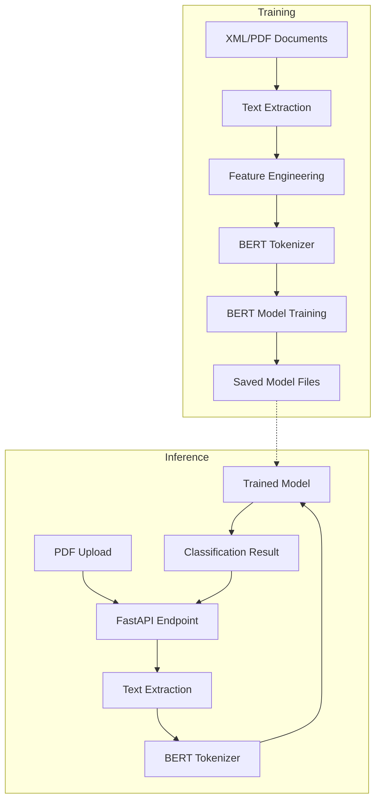
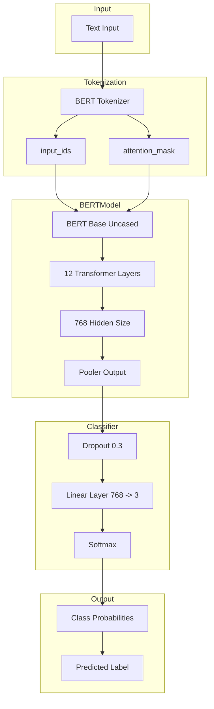
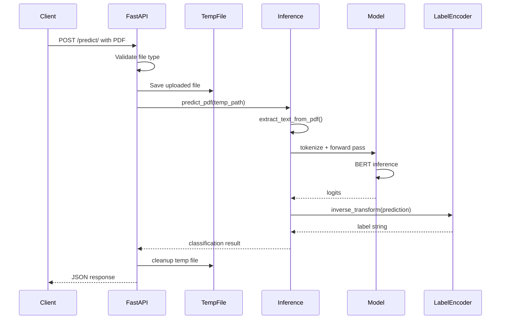
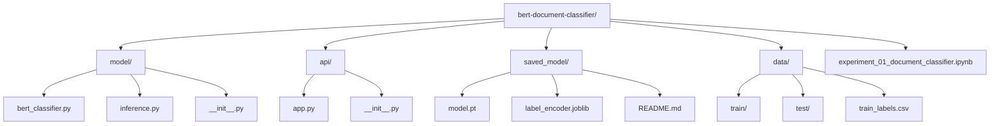
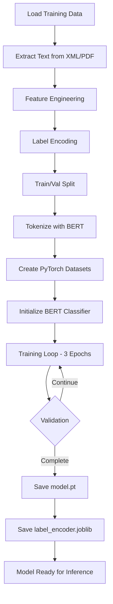
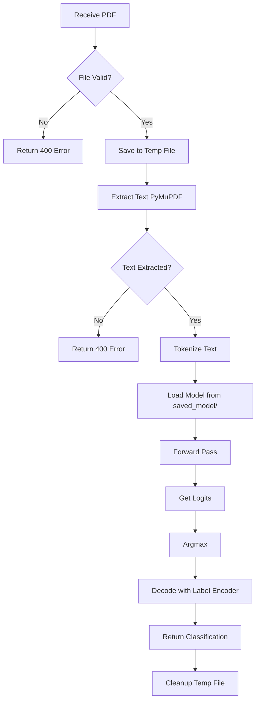
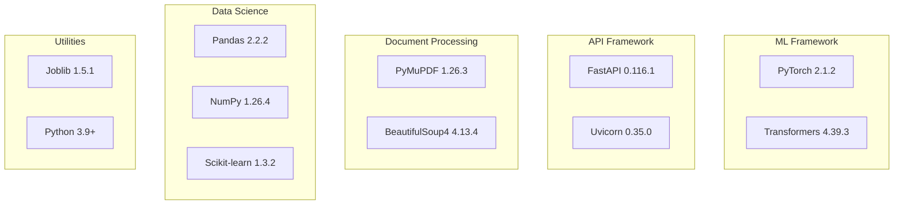
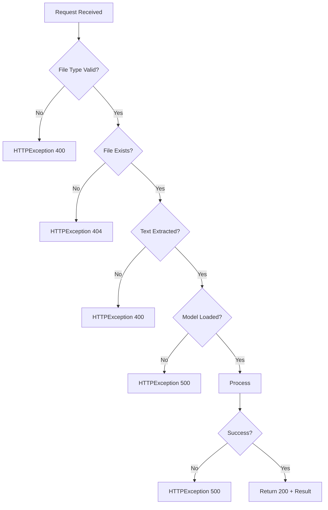

# Project Architecture

## Overview

This project implements a BERT-based document classifier that categorizes scientific paper references into three types: Primary, Secondary, or Missing. The system consists of a training pipeline, a BERT model, and a FastAPI-based inference service.

## System Architecture



## Data Flow


## Model Architecture



## API Architecture



## Directory Structure



## Component Interactions

```mermaid
graph LR
    subgraph API Layer
        A[FastAPI App]
        A1[/predict/]
        A2[/health]
        A3[/]
    end
    
    subgraph Model Layer
        B[inference.py]
        B1[extract_text_from_pdf]
        B2[predict_pdf]
    end
    
    subgraph Core Model
        C[BertClassifier]
        C1[BERT Base]
        C2[Dropout]
        C3[Linear Layer]
    end
    
    subgraph External Files
        D[saved_model/]
        D1[model.pt]
        D2[label_encoder.joblib]
    end
    
    A --> A1
    A --> A2
    A --> A3
    A1 --> B2
    B2 --> B1
    B2 --> C
    C --> C1
    C1 --> C2
    C2 --> C3
    C --> D1
    B2 --> D2
```

## Training Pipeline



## Inference Pipeline



## Key Design Decisions

### 1. Model Selection
- **BERT Base Uncased**: 110M parameters, good balance of performance and speed
- **Max Length 512**: Standard BERT limit, handles most document sections
- **Dropout 0.3**: Regularization to prevent overfitting

### 2. Data Processing
- **PyMuPDF over PyPDF2**: Better text extraction quality and speed
- **BeautifulSoup for XML**: Robust parsing of structured XML documents
- **Feature engineering**: Captures data reference patterns

### 3. API Design
- **FastAPI**: Modern async framework with automatic API docs
- **Temporary file handling**: Secure file processing with cleanup
- **Error handling**: Proper HTTP status codes and error messages

### 4. Deployment Considerations
- **Model files gitignored**: Keep repository size manageable
- **Separate requirements files**: Minimal deps for inference, full deps for training
- **Health check endpoint**: Enable monitoring and container orchestration

## Performance Characteristics

### Model Performance
- Accuracy: 95%
- Primary class: 91% precision, 93% recall
- Secondary class: 99% precision, 94% recall
- Missing class: 95% precision, 99% recall

### Inference Speed
- Text extraction: ~100-500ms per PDF
- Model inference: ~50-200ms per document
- Total latency: ~150-700ms depending on PDF size

### Resource Requirements
- Model size: ~440 MB (BERT weights)
- Memory usage: ~2-4 GB during inference
- GPU recommended but not required

## Technology Stack



## Error Handling Strategy



## Future Enhancements

1. **Model Improvements**
   - Fine-tune on domain-specific data
   - Experiment with larger models (BERT-Large, RoBERTa)
   - Add confidence scores to predictions

2. **API Enhancements**
   - Batch prediction endpoint
   - Support for more file formats
   - Caching layer for repeated requests

3. **Infrastructure**
   - Docker containerization
   - Kubernetes deployment
   - Model versioning and A/B testing

4. **Monitoring**
   - Prediction logging
   - Performance metrics
   - Model drift detection

